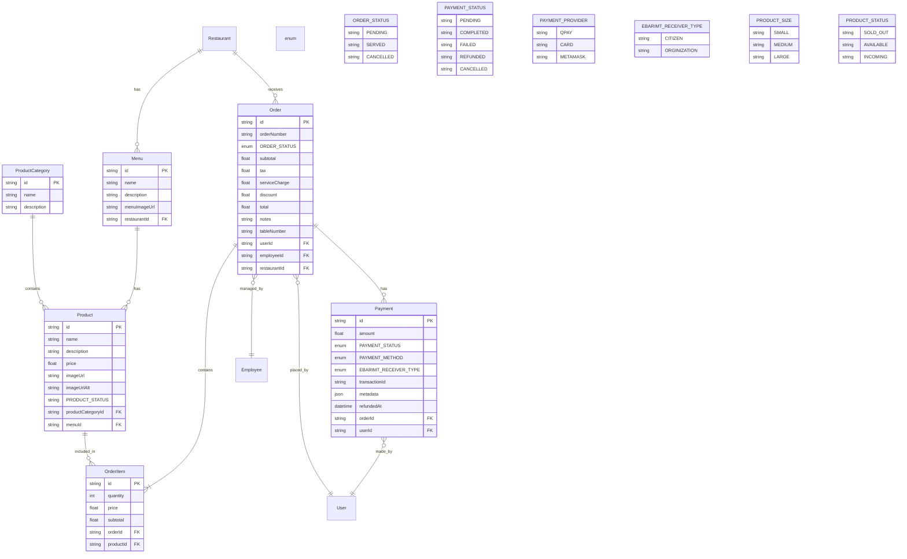

```mermaid
erDiagram
    Restaurant ||--o{ Order : receives
    Restaurant ||--o{ Menu : has

    ProductCategory ||--o{ Product : contains

    Product ||--o{ OrderItem : included_in


    Order ||--|{ OrderItem : contains
    Order ||--o{ Payment : has
    Order }o--|| User : placed_by
    Order }o--|| Employee : managed_by

    Menu ||--o{ Product : has
    Payment }o--|| User : made_by

    Menu {
        string id PK
        string name
        string description
        string menuImageUrl
        string restaurantId FK
    }

    Product {
        string id PK
        string name
        string description
        float price
        string imageUrl
        string imageUrlAlt
        string PRODUCT_STATUS
        string productCategoryId FK
        string menuId FK
    }

    ProductCategory {
        string id PK
        string name
        string description
    }

    OrderItem {
        string id PK
        int quantity
        float price
        float subtotal
        string orderId FK
        string productId FK
    }

    Order {
        string id PK
        string orderNumber
        enum ORDER_STATUS
        float subtotal
        float tax
        float serviceCharge
        float discount
        float total
        string notes
        string tableNumber
        string userId FK
        string employeeId FK
        string restaurantId FK
    }

    Payment {
        string id PK
        float amount
        enum PAYMENT_STATUS
        enum PAYMENT_METHOD
        enum EBARIMT_RECEIVER_TYPE
        string transactionId
        json metadata
        datetime refundedAt
        string orderId FK
        string userId FK
    }

enum ORDER_STATUS {
    string PENDING
    string SERVED
    string CANCELLED
}

enum PAYMENT_STATUS {
    string PENDING
    string COMPLETED
    string FAILED
    string REFUNDED
    string CANCELLED
}

enum PAYMENT_PROVIDER {
    string QPAY
    string CARD
    string METAMASK
}

enum EBARIMT_RECEIVER_TYPE {
    string CITIZEN
    string ORGINIZATION
}

enum PRODUCT_SIZE {
    string SMALL
    string MEDIUM
    string LARGE
}

enum PRODUCT_STATUS {
    string SOLD_OUT
    string AVAILABLE
    string INCOMING
}
```
